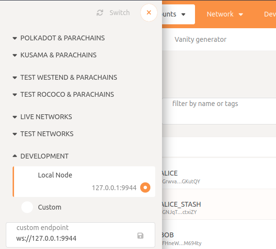
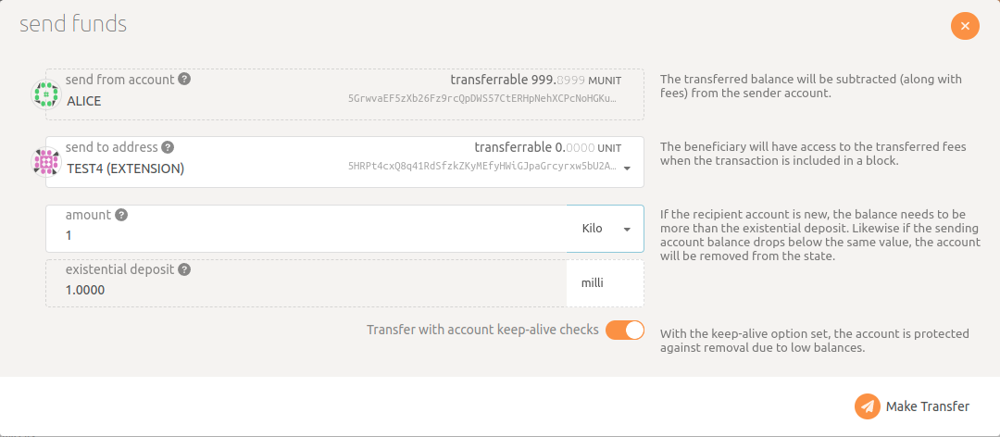

# Getting Started with the Client Example

This project is a *minimal* example demonstrating how to include the Prosopo human verification system in a client app.

## Prerequisites

You will need to have access to a substrate node with the [protocol contract](https://github.com/prosopo/protocol)
and also a [provider API instance](https://github.com/prosopo/provider) to run the demo. Follow
the [development environment set up instructions in our integration repository](https://github.com/prosopo/integration#development-environment-set-up)
to spin up the required containers.

## Config

The following env vars will need to be set in a `.env` file for this example to run.

```bash
REACT_APP_API_BASE_URL
REACT_APP_API_PATH_PREFIX
REACT_APP_DAPP_CONTRACT_ADDRESS
```

If using
the [integration development environment](https://github.com/prosopo/integration#development-environment-set-up),
these variables will be as follows:

```bash
REACT_APP_API_BASE_URL=http://localhost:3000
REACT_APP_API_PATH_PREFIX=/v1/prosopo
REACT_APP_DAPP_CONTRACT_ADDRESS=5Go2hCf1WHzKqt1HGCUwhKfUS85477HUHgvaKkMJRYBfyiUP
```

## Implementation

The captcha component is created using the React
package [procaptcha-react](https://github.com/prosopo/procaptcha-react).

## How to run locally

#### 1. Copy the env.development file

Copy the file `env.development` to `.env.development` in the root directory.

#### 2. Fund your test account

##### 2a. Wallet Setup

You will need to have a test account present in a polkadot wallet. Choose either
[talisman](https://chrome.google.com/webstore/detail/talisman-polkadot-wallet/fijngjgcjhjmmpcmkeiomlglpeiijkld)
, [subwallet](https://chrome.google.com/webstore/detail/subwallet-polkadot-extens/onhogfjeacnfoofkfgppdlbmlmnplgbn)
or [polkadotjs](https://polkadot.js.org/extension/). Please only install *one* wallet in your browser! Once you have
installed a wallet, create an account.

##### 2b. Send some funds to your wallet

Go to [polkadot apps](https://polkadot.js.org/apps/?rpc=ws%3A%2F%2F127.0.0.1%3A9944#/accounts) and select the
development endpoint (`ws://localhost:9944`).



Send some funds from one of the test accounts (Alice etc.) to your test account.




#### 3. Start the app

In the project directory, you can run:

`npm start`

This runs the app in the development mode. Open [http://localhost:3001](http://localhost:3001) to view it in the
browser.

The page will reload if you make edits. You will also see any lint errors in the console.
