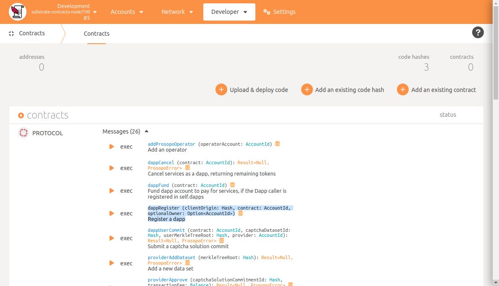

# Procaptcha

Contains interfaces for accessing the Prosopo [protocol](https://github.com/prosopo/protocol/) contract,
Prosopo [provider](https://github.com/prosopo/provider) API and the captcha client state via the `ProsopoCaptchaClient`
, `ProsopoCaptchaApi` and `ProsopoCaptchaStateClient` classes.

## Prerequisites

The Dapp smart contract account must
be [registered](https://github.com/prosopo/protocol/blob/5cb282a911522bfbf29d34d1830badee3eecec83/contracts/lib.rs#L698-L737)
in the Prosopo [protocol](https://github.com/prosopo/protocol/) contract in order to interact with the Prosopo protocol.
You can complete Dapp registration by navigating to [polkadot-js apps](https://polkadot.js.org/apps/) and using the
contracts page.

## Usage

This repository can be imported into any JavaScript framework and used to create a CAPTCHA User Interface. See, for
example, the [procaptcha-react](https://github.com/prosopo/procaptcha-react) repository.
